lesson 4
========================================================

### Scatterplots and Perceived Audience Size
Notes:
Scatterplots to check the relationship between continuous variables.
***

### Working directory

<pre class="knitr r">work_dir <- '/Users/RickyLim/Documents/OnlineLearning/DataAnalysisR/'
</pre>

### Scatterplots
Notes:

<pre class="knitr r">library(ggplot2)
pf <- read.csv(paste0(work_dir, 'Data/pseudo_facebook.tsv'), sep='\t')
head(pf)
</pre>

<pre class="knitr r">##    userid age dob_day dob_year dob_month gender tenure friend_count
## 1 2094382  14      19     1999        11   male    266            0
## 2 1192601  14       2     1999        11 female      6            0
## 3 2083884  14      16     1999        11   male     13            0
## 4 1203168  14      25     1999        12 female     93            0
## 5 1733186  14       4     1999        12   male     82            0
## 6 1524765  14       1     1999        12   male     15            0
##   friendships_initiated likes likes_received mobile_likes
## 1                     0     0              0            0
## 2                     0     0              0            0
## 3                     0     0              0            0
## 4                     0     0              0            0
## 5                     0     0              0            0
## 6                     0     0              0            0
##   mobile_likes_received www_likes www_likes_received
## 1                     0         0                  0
## 2                     0         0                  0
## 3                     0         0                  0
## 4                     0         0                  0
## 5                     0         0                  0
## 6                     0         0                  0
</pre>

<pre class="knitr r">qplot(x=age, y=friend_count, data=pf)
</pre>

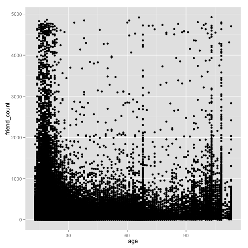

***

#### What are some things that you notice right away?
Response:
Most of high friend counts are scattered arount the age below 30.
There are some peculiars observations, where old people (older than 60) have high friend counts.

***

### ggplot Syntax
Notes:

<pre class="knitr r">ggplot(aes(x=age,y=friend_count), data=pf) +
        geom_point() + xlim(13,90) 
</pre>

<pre class="knitr r">## Warning: Removed 4906 rows containing missing values (geom_point).
</pre>

***

### Overplotting
Notes:
age is a continous variable.

<pre class="knitr r">ggplot(aes(x=age,y=friend_count), data=pf) +
        geom_jitter(alpha=1/20) + 
        xlim(13,90) 
</pre>

<pre class="knitr r">## Warning: Removed 5193 rows containing missing values (geom_point).
</pre>

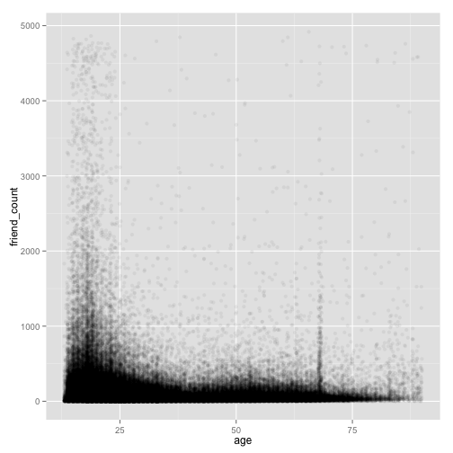

<pre class="knitr r"># alpha 1/20 means 20 points equals to a single dot.
</pre>

#### What do you notice in the plot?
Response:

***

### Coord_trans()
Notes:
- To transform the distance in coordinates, particularly if there is an extreme high value.

<pre class="knitr r">ggplot(aes(x=age,y=friend_count), data=pf) +
        geom_jitter(alpha=1/20, position=position_jitter(h=0)) + 
        coord_trans(y="sqrt")
</pre>

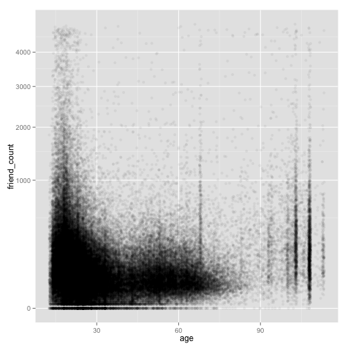

#### Look up the documentation for coord_trans() and add a layer to the plot that transforms friend_count using the square root function. Create your plot!

<pre class="knitr r">head(pf)
</pre>

<pre class="knitr r">##    userid age dob_day dob_year dob_month gender tenure friend_count
## 1 2094382  14      19     1999        11   male    266            0
## 2 1192601  14       2     1999        11 female      6            0
## 3 2083884  14      16     1999        11   male     13            0
## 4 1203168  14      25     1999        12 female     93            0
## 5 1733186  14       4     1999        12   male     82            0
## 6 1524765  14       1     1999        12   male     15            0
##   friendships_initiated likes likes_received mobile_likes
## 1                     0     0              0            0
## 2                     0     0              0            0
## 3                     0     0              0            0
## 4                     0     0              0            0
## 5                     0     0              0            0
## 6                     0     0              0            0
##   mobile_likes_received www_likes www_likes_received
## 1                     0         0                  0
## 2                     0         0                  0
## 3                     0         0                  0
## 4                     0         0                  0
## 5                     0         0                  0
## 6                     0         0                  0
</pre>

<pre class="knitr r">ggplot(aes(x=age, y=friendships_initiated), data=pf) +
    geom_point() 
</pre>

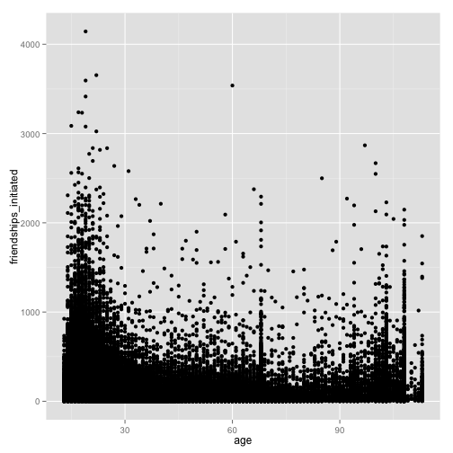

#### What do you notice?

***

### Alpha and Jitter
Notes:

<pre class="knitr r">head(pf)
</pre>

<pre class="knitr r">##    userid age dob_day dob_year dob_month gender tenure friend_count
## 1 2094382  14      19     1999        11   male    266            0
## 2 1192601  14       2     1999        11 female      6            0
## 3 2083884  14      16     1999        11   male     13            0
## 4 1203168  14      25     1999        12 female     93            0
## 5 1733186  14       4     1999        12   male     82            0
## 6 1524765  14       1     1999        12   male     15            0
##   friendships_initiated likes likes_received mobile_likes
## 1                     0     0              0            0
## 2                     0     0              0            0
## 3                     0     0              0            0
## 4                     0     0              0            0
## 5                     0     0              0            0
## 6                     0     0              0            0
##   mobile_likes_received www_likes www_likes_received
## 1                     0         0                  0
## 2                     0         0                  0
## 3                     0         0                  0
## 4                     0         0                  0
## 5                     0         0                  0
## 6                     0         0                  0
</pre>

<pre class="knitr r">ggplot(aes(x=age, y=friendships_initiated), data=pf) +
    geom_jitter(alpha=1/20, position=position_jitter(h=0))+
    xlim(c(13,90)) +
    coord_trans(y='sqrt')
</pre>

<pre class="knitr r">## Warning: Removed 5171 rows containing missing values (geom_point).
</pre>

***

### Overplotting and Domain Knowledge
Notes:
common functions in dplyr: filter(), group_by(), mutate(), and arrange().

***

### Conditional Means
Notes:

<pre class="knitr r">library(dplyr)

# create the dataframe of mean and median of friends counts for each age group.

age_groups <- group_by(pf, age)
head(age_groups)
</pre>

<pre class="knitr r">## Source: local data frame [6 x 15]
## Groups: age
## 
##    userid age dob_day dob_year dob_month gender tenure friend_count
## 1 2094382  14      19     1999        11   male    266            0
## 2 1192601  14       2     1999        11 female      6            0
## 3 2083884  14      16     1999        11   male     13            0
## 4 1203168  14      25     1999        12 female     93            0
## 5 1733186  14       4     1999        12   male     82            0
## 6 1524765  14       1     1999        12   male     15            0
## Variables not shown: friendships_initiated (int), likes (int),
##   likes_received (int), mobile_likes (int), mobile_likes_received (int),
##   www_likes (int), www_likes_received (int)
</pre>

<pre class="knitr r">pf.fc_by_age <- summarise(age_groups, 
          friend_count_mean = mean(friend_count),
          friend_count_median = median(friend_count),
          n = n())
head(pf.fc_by_age)
</pre>

<pre class="knitr r">## Source: local data frame [6 x 4]
## 
##   age friend_count_mean friend_count_median    n
## 1  13          164.7500                74.0  484
## 2  14          251.3901               132.0 1925
## 3  15          347.6921               161.0 2618
## 4  16          351.9371               171.5 3086
## 5  17          350.3006               156.0 3283
## 6  18          331.1663               162.0 5196
</pre>

<pre class="knitr r">pf.fc_by_age <- arrange(pf.fc_by_age, age)

# alternative code

pf.fc_by_age <- pf %>% 
    group_by(age) %>%
    summarise(friend_count_mean = mean(friend_count),
              friend_count_median = median(friend_count),
              n = n()) %>%
    arrange(age)
</pre>

Create your plot!

<pre class="knitr r">head(pf.fc_by_age)
</pre>

<pre class="knitr r">## Source: local data frame [6 x 4]
## 
##   age friend_count_mean friend_count_median    n
## 1  13          164.7500                74.0  484
## 2  14          251.3901               132.0 1925
## 3  15          347.6921               161.0 2618
## 4  16          351.9371               171.5 3086
## 5  17          350.3006               156.0 3283
## 6  18          331.1663               162.0 5196
</pre>

<pre class="knitr r">ggplot(aes(x=age, y=friend_count_mean), data=pf.fc_by_age) +
    geom_line() +
    xlim(c(13,90))
</pre>

<pre class="knitr r">## Warning: Removed 23 rows containing missing values (geom_path).
</pre>

***

### Overlaying Summaries with Raw Data
Notes:

<pre class="knitr r">p <- ggplot(aes(x=age, y=friendships_initiated), data=pf) +
    coord_cartesian(xlim=c(13,70), ylim=c(0,1000))+
    geom_point(alpha=0.05, position=position_jitter(h=0), color='orange')+
    geom_line(stat='summary', fun.y=mean) +
    geom_line(stat='summary', fun.y=quantile, prob=0.1,
              linetype=2, color='blue') +
    geom_line(stat='summary', fun.y=quantile, prob=0.5,
              linetype=2, color='blue') +
    geom_line(stat='summary', fun.y=quantile, prob=0.9,
              linetype=2, color='blue')
p
</pre>

#### What are some of your observations of the plot?
Response:

90% of the age group of 13-30 are less than 500 friends. 
Whereas the older group are bound to 250 friends.
There is a strange observation for the group of age ca.69 in which it has a spike.
***

### Moira: Histogram Summary and Scatterplot
See the Instructor Notes of this video to download Moira's paper on perceived audience size and to see the final plot.

Notes:

From the scatter plot --> draws the histogram plots that has over and underestimation.

***

### Correlation
Notes:

<pre class="knitr r">head(pf)
</pre>

<pre class="knitr r">##    userid age dob_day dob_year dob_month gender tenure friend_count
## 1 2094382  14      19     1999        11   male    266            0
## 2 1192601  14       2     1999        11 female      6            0
## 3 2083884  14      16     1999        11   male     13            0
## 4 1203168  14      25     1999        12 female     93            0
## 5 1733186  14       4     1999        12   male     82            0
## 6 1524765  14       1     1999        12   male     15            0
##   friendships_initiated likes likes_received mobile_likes
## 1                     0     0              0            0
## 2                     0     0              0            0
## 3                     0     0              0            0
## 4                     0     0              0            0
## 5                     0     0              0            0
## 6                     0     0              0            0
##   mobile_likes_received www_likes www_likes_received
## 1                     0         0                  0
## 2                     0         0                  0
## 3                     0         0                  0
## 4                     0         0                  0
## 5                     0         0                  0
## 6                     0         0                  0
</pre>

<pre class="knitr r">cor(pf$age, pf$friend_count)
</pre>

<pre class="knitr r">## [1] -0.02740737
</pre>

<pre class="knitr r">cor.test(pf$age, pf$friend_count, method="pearson")
</pre>

<pre class="knitr r">## 
## 	Pearson's product-moment correlation
## 
## data:  pf$age and pf$friend_count
## t = -8.6268, df = 99001, p-value < 2.2e-16
## alternative hypothesis: true correlation is not equal to 0
## 95 percent confidence interval:
##  -0.03363072 -0.02118189
## sample estimates:
##         cor 
## -0.02740737
</pre>

<pre class="knitr r">with(pf, cor.test(age, friend_count, method="pearson"))
</pre>

<pre class="knitr r">## 
## 	Pearson's product-moment correlation
## 
## data:  age and friend_count
## t = -8.6268, df = 99001, p-value < 2.2e-16
## alternative hypothesis: true correlation is not equal to 0
## 95 percent confidence interval:
##  -0.03363072 -0.02118189
## sample estimates:
##         cor 
## -0.02740737
</pre>

<pre class="knitr r">with(subset(pf, age <= 70), cor.test(age, friend_count, method="spearmon"))
</pre>

<pre class="knitr r">## Error in match.arg(method): 'arg' should be one of "pearson", "kendall", "spearman"
</pre>

### Correlation Methods
Notes:

***

## Create Scatterplots
Notes:

<pre class="knitr r">ggplot(aes(x=www_likes_received, y=likes_received), data=pf) +
    geom_point()
</pre>

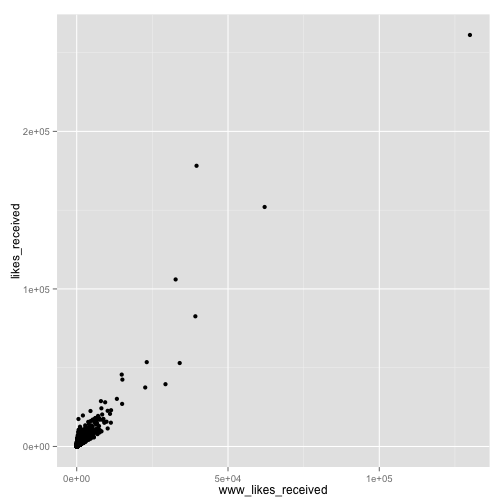

***

### Strong Correlations
Notes:

<pre class="knitr r">ggplot(aes(x=www_likes_received, y=likes_received), data=pf) +
    geom_point() + 
    xlim(0,quantile(pf$www_likes_received, 0.95)) +
    ylim(0, quantile(pf$likes_received, 0.95)) +
    geom_smooth(method='lm', color='red')
</pre>

<pre class="knitr r">## Warning: Removed 6075 rows containing missing values (stat_smooth).
</pre>

<pre class="knitr r">## Warning: Removed 6075 rows containing missing values (geom_point).
</pre>

<pre class="knitr r">cor.test(pf$www_likes_received, pf$likes_received)
</pre>

<pre class="knitr r">## 
## 	Pearson's product-moment correlation
## 
## data:  pf$www_likes_received and pf$likes_received
## t = 937.1035, df = 99001, p-value < 2.2e-16
## alternative hypothesis: true correlation is not equal to 0
## 95 percent confidence interval:
##  0.9473553 0.9486176
## sample estimates:
##       cor 
## 0.9479902
</pre>

What's the correlation betwen the two variables? Include the top 5% of values for the variable in the calculation and round to 3 decimal places.

Response:

***

### Moira on Correlation
Notes:

***

### More Caution with Correlation
Notes:

<pre class="knitr r">#install.packages('alr3')
library(alr3)
data(Mitchell)
tail(Mitchell)
</pre>

<pre class="knitr r">##     Month     Temp
## 199   198 22.69440
## 200   199 21.77220
## 201   200 18.12780
## 202   201 11.25560
## 203   202  2.41667
## 204   203 -1.62778
</pre>

<pre class="knitr r">summary(Mitchell$Month)
</pre>

<pre class="knitr r">##    Min. 1st Qu.  Median    Mean 3rd Qu.    Max. 
##    0.00   50.75  101.50  101.50  152.20  203.00
</pre>

<pre class="knitr r">ggplot(aes(x=Month, y=Temp), data=Mitchell) +
    geom_point() +
    scale_x_discrete(breaks=seq(0,203,12))
</pre>

<pre class="knitr r">cor.test(Mitchell$Temp, Mitchell$Month)
</pre>

<pre class="knitr r">## 
## 	Pearson's product-moment correlation
## 
## data:  Mitchell$Temp and Mitchell$Month
## t = 0.8182, df = 202, p-value = 0.4142
## alternative hypothesis: true correlation is not equal to 0
## 95 percent confidence interval:
##  -0.08053637  0.19331562
## sample estimates:
##        cor 
## 0.05747063
</pre>

### Making Sense of Data
Notes:

***

### A New Perspective

What do you notice?
Response:

Watch the solution video and check out the Instructor Notes!
Notes:

***

### Understanding Noise: Age to Age Months
Notes:

<pre class="knitr r">head(pf)
</pre>

<pre class="knitr r">##    userid age dob_day dob_year dob_month gender tenure friend_count
## 1 2094382  14      19     1999        11   male    266            0
## 2 1192601  14       2     1999        11 female      6            0
## 3 2083884  14      16     1999        11   male     13            0
## 4 1203168  14      25     1999        12 female     93            0
## 5 1733186  14       4     1999        12   male     82            0
## 6 1524765  14       1     1999        12   male     15            0
##   friendships_initiated likes likes_received mobile_likes
## 1                     0     0              0            0
## 2                     0     0              0            0
## 3                     0     0              0            0
## 4                     0     0              0            0
## 5                     0     0              0            0
## 6                     0     0              0            0
##   mobile_likes_received www_likes www_likes_received
## 1                     0         0                  0
## 2                     0         0                  0
## 3                     0         0                  0
## 4                     0         0                  0
## 5                     0         0                  0
## 6                     0         0                  0
</pre>

<pre class="knitr r">pf$age_with_months <- pf$age + (12- pf$dob_month)/12
</pre>

***

### Age with Months Means

<pre class="knitr r">pf.fc_by_age_with_months <- pf %>%
                    group_by(age_with_months) %>%
                    summarise(mean_fc=mean(friend_count),
                                median_fc=median(friend_count),
                                n=n()) %>%
                    arrange(age_with_months)
head(pf.fc_by_age_with_months)
</pre>

<pre class="knitr r">## Source: local data frame [6 x 4]
## 
##   age_with_months   mean_fc median_fc  n
## 1        13.16667  46.33333      30.5  6
## 2        13.25000 115.07143      23.5 14
## 3        13.33333 136.20000      44.0 25
## 4        13.41667 164.24242      72.0 33
## 5        13.50000 131.17778      66.0 45
## 6        13.58333 156.81481      64.0 54
</pre>

Programming Assignment

<pre class="knitr r">p1 <- ggplot(aes(x=age, y=friend_count_mean), 
             data=subset(pf.fc_by_age, age<71)) +
        geom_line() +  
        geom_smooth(method='lm', color='red')

p2 <- ggplot(aes(x=age_with_months, y=mean_fc), 
             data=subset(pf.fc_by_age_with_months, age_with_months<71))+
        geom_line() +
        geom_smooth(method='lm', color='red')

# within +/- 2.5 years
p3 <- ggplot(aes(x=round(age/5)*5, y=friend_count),
             data=subset(pf, age < 71)) +
        geom_line(stat='summary', fun.y=mean)

library(gridExtra)
grid.arrange(p1, p2, p3, ncol=1)
</pre>

Notes:

There is a trade-off between the noise and the precision.

Less datapoints with wider bin width means that we will estimate means more precisely (as in the wider bin you have more n data to estimate the mean). But it may miss the important feature between the relationship of age and friend_count.

Sol: to use the stat flexible smoothing function. 

***

### Noise in Conditional Means

***

### Smoothing Conditional Means
Notes:

***

### Which Plot to Choose?
Notes:

***

### Analyzing Two Variables
Reflection:

- Scatterplot
- jitter (to add noise)
- alpha
- ddplyr (piping, group_by, summarise, arrange)
- conditional means
- Sceptical about the units to be plotted in a scatterplot
- correlation test
- Bivariate [lecture](http://dept.stat.lsa.umich.edu/~kshedden/Courses/Stat401/Notes/401-bivariate-slides.pdf)

***

### ProblemSet

<pre class="knitr r">data(diamonds)
head(diamonds)
</pre>

<pre class="knitr r">##   carat       cut color clarity depth table price    x    y    z
## 1  0.23     Ideal     E     SI2  61.5    55   326 3.95 3.98 2.43
## 2  0.21   Premium     E     SI1  59.8    61   326 3.89 3.84 2.31
## 3  0.23      Good     E     VS1  56.9    65   327 4.05 4.07 2.31
## 4  0.29   Premium     I     VS2  62.4    58   334 4.20 4.23 2.63
## 5  0.31      Good     J     SI2  63.3    58   335 4.34 4.35 2.75
## 6  0.24 Very Good     J    VVS2  62.8    57   336 3.94 3.96 2.48
</pre>

<pre class="knitr r">ggplot(aes(x=price, y=x), data=diamonds) +
    geom_point()
</pre>

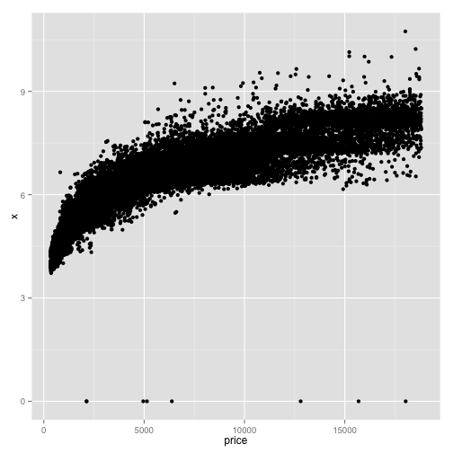

<pre class="knitr r">with(diamonds, cor.test(price, x))
</pre>

<pre class="knitr r">## 
## 	Pearson's product-moment correlation
## 
## data:  price and x
## t = 440.1594, df = 53938, p-value < 2.2e-16
## alternative hypothesis: true correlation is not equal to 0
## 95 percent confidence interval:
##  0.8825835 0.8862594
## sample estimates:
##       cor 
## 0.8844352
</pre>

<pre class="knitr r">with(diamonds, cor.test(price, y))
</pre>

<pre class="knitr r">## 
## 	Pearson's product-moment correlation
## 
## data:  price and y
## t = 401.1415, df = 53938, p-value < 2.2e-16
## alternative hypothesis: true correlation is not equal to 0
## 95 percent confidence interval:
##  0.8632867 0.8675241
## sample estimates:
##       cor 
## 0.8654209
</pre>

<pre class="knitr r">with(diamonds, cor.test(price, z))
</pre>

<pre class="knitr r">## 
## 	Pearson's product-moment correlation
## 
## data:  price and z
## t = 393.6015, df = 53938, p-value < 2.2e-16
## alternative hypothesis: true correlation is not equal to 0
## 95 percent confidence interval:
##  0.8590541 0.8634131
## sample estimates:
##       cor 
## 0.8612494
</pre>

<pre class="knitr r">summary(diamonds$depth)
</pre>

<pre class="knitr r">##    Min. 1st Qu.  Median    Mean 3rd Qu.    Max. 
##   43.00   61.00   61.80   61.75   62.50   79.00
</pre>

<pre class="knitr r">p<- ggplot(aes(x=depth, y=price), data=diamonds) +
    geom_point(alpha=1/100)+
    scale_x_continuous(breaks=seq(40,80,2))
p
</pre>

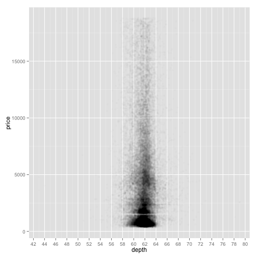

<pre class="knitr r">with(diamonds, cor.test(depth, price))
</pre>

<pre class="knitr r">## 
## 	Pearson's product-moment correlation
## 
## data:  depth and price
## t = -2.473, df = 53938, p-value = 0.0134
## alternative hypothesis: true correlation is not equal to 0
## 95 percent confidence interval:
##  -0.019084756 -0.002208537
## sample estimates:
##        cor 
## -0.0106474
</pre>

<pre class="knitr r">names(diamonds)
</pre>

<pre class="knitr r">##  [1] "carat"   "cut"     "color"   "clarity" "depth"   "table"   "price"  
##  [8] "x"       "y"       "z"
</pre>

<pre class="knitr r">head(diamonds)
</pre>

<pre class="knitr r">##   carat       cut color clarity depth table price    x    y    z
## 1  0.23     Ideal     E     SI2  61.5    55   326 3.95 3.98 2.43
## 2  0.21   Premium     E     SI1  59.8    61   326 3.89 3.84 2.31
## 3  0.23      Good     E     VS1  56.9    65   327 4.05 4.07 2.31
## 4  0.29   Premium     I     VS2  62.4    58   334 4.20 4.23 2.63
## 5  0.31      Good     J     SI2  63.3    58   335 4.34 4.35 2.75
## 6  0.24 Very Good     J    VVS2  62.8    57   336 3.94 3.96 2.48
</pre>

<pre class="knitr r">p <- ggplot(aes(x=price, y=carat), data=diamonds)+
    geom_point()+
    coord_cartesian(xlim=c(0, quantile(diamonds$carat,0.99)),
                    ylim=c(0, quantile(diamonds$price,0.99)))
p
</pre>

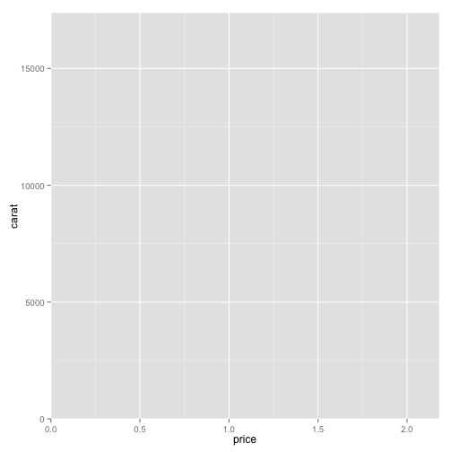

The plot shows exponential relationship between the length and the price of diamonds in the given dataset with some outliers.

<pre class="knitr r">dia <- diamonds
dia$vol <- dia$x*dia$y*dia$z
head(dia)
</pre>

<pre class="knitr r">##   carat       cut color clarity depth table price    x    y    z      vol
## 1  0.23     Ideal     E     SI2  61.5    55   326 3.95 3.98 2.43 38.20203
## 2  0.21   Premium     E     SI1  59.8    61   326 3.89 3.84 2.31 34.50586
## 3  0.23      Good     E     VS1  56.9    65   327 4.05 4.07 2.31 38.07688
## 4  0.29   Premium     I     VS2  62.4    58   334 4.20 4.23 2.63 46.72458
## 5  0.31      Good     J     SI2  63.3    58   335 4.34 4.35 2.75 51.91725
## 6  0.24 Very Good     J    VVS2  62.8    57   336 3.94 3.96 2.48 38.69395
</pre>

<pre class="knitr r">p <- ggplot(aes(x=price, y=vol), data=dia) +
        geom_point() 
p
</pre>

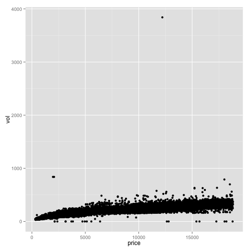

<pre class="knitr r">volZero <- NA
dia$volZero <- ifelse(dia$vol==0, TRUE, FALSE)
dia$volZero <- factor(dia$volZero)
table(dia$volZero)
</pre>

<pre class="knitr r">## 
## FALSE  TRUE 
## 53920    20
</pre>

<pre class="knitr r">diaNonZero <- subset(dia, vol != 0 & vol < 800)
with(diaNonZero, cor.test(price, vol))
</pre>

<pre class="knitr r">## 
## 	Pearson's product-moment correlation
## 
## data:  price and vol
## t = 559.1912, df = 53915, p-value < 2.2e-16
## alternative hypothesis: true correlation is not equal to 0
## 95 percent confidence interval:
##  0.9222944 0.9247772
## sample estimates:
##       cor 
## 0.9235455
</pre>

<pre class="knitr r">diamonds$volume <- diamonds$x * diamonds$y * diamonds$z
diamonds_selected <- subset(diamonds, volume != 0 & volume < 800)
p <- ggplot(aes(x=volume, y=price), data=diamonds_selected) +
        geom_point(alpha=1/20)+
        geom_smooth(method='lm', color='red') +
        geom_smooth(method='lm', formula = y ~ poly(x, 2, raw=TRUE), color='blue')+
        geom_smooth(method='lm', formula = y ~ poly(x, 3, raw=TRUE), color='green')+
        coord_cartesian(xlim=c(0,400), ylim=c(0,4000))
p
</pre>

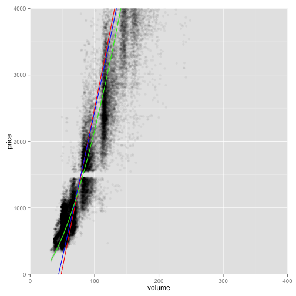

<pre class="knitr r">names(diamonds)
</pre>

<pre class="knitr r">##  [1] "carat"   "cut"     "color"   "clarity" "depth"   "table"   "price"  
##  [8] "x"       "y"       "z"       "volume"
</pre>

<pre class="knitr r">price_clarity <- diamonds %>%
                    group_by(clarity) %>%
                    summarise(mean_price = mean(price),
                              median_price = median(price),
                              min_price = min(price),
                              max_price = max(price),
                              n = n()) 
price_color <- diamonds %>%
                    group_by(color) %>%
                    summarise(mean_price = mean(price),
                              median_price = median(price),
                              min_price = min(price),
                              max_price = max(price),
                              n = n()) 
head(price_clarity)
</pre>

<pre class="knitr r">## Source: local data frame [6 x 6]
## 
##   clarity mean_price median_price min_price max_price     n
## 1      I1   3924.169         3344       345     18531   741
## 2     SI2   5063.029         4072       326     18804  9194
## 3     SI1   3996.001         2822       326     18818 13065
## 4     VS2   3924.989         2054       334     18823 12258
## 5     VS1   3839.455         2005       327     18795  8171
## 6    VVS2   3283.737         1311       336     18768  5066
</pre>

<pre class="knitr r">head(price_color)
</pre>

<pre class="knitr r">## Source: local data frame [6 x 6]
## 
##   color mean_price median_price min_price max_price     n
## 1     D   3169.954         1838       357     18693  6775
## 2     E   3076.752         1739       326     18731  9797
## 3     F   3724.886         2343       342     18791  9542
## 4     G   3999.136         2242       354     18818 11292
## 5     H   4486.669         3460       337     18803  8304
## 6     I   5091.875         3730       334     18823  5422
</pre>

<pre class="knitr r">p1 <- ggplot(aes(x=clarity, y=mean_price), data=price_clarity) + 
        geom_bar(stat='identity')
p2 <- ggplot(aes(x=color, y=mean_price), data=price_color) + 
        geom_bar(stat='identity')
grid.arrange(p1, p2, ncol=1)
</pre>

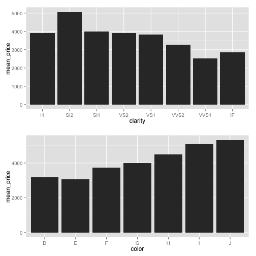

There is an exponential relationship between the price and the volume with some outliers.
There's an expensive diamond with a volume near 4000 and a cheaper diamond with a volume near 900.

Histogram vs Barplot, blog [here](http://flowingdata.com/2014/02/27/how-to-read-histograms-and-use-them-in-r/)

<pre class="knitr r">library(knitrBootstrap)
knit_bootstrap('lesson4_student.rmd')
</pre>

<pre class="knitr r">## 
## 
## processing file: lesson4_student.rmd
</pre>

<pre class="knitr r">## Error in parse_block(g, patterns): duplicate label 'workdir'
</pre>

<pre class="knitr r">sessionInfo()
</pre>

<pre class="knitr r">## R version 3.1.1 (2014-07-10)
## Platform: x86_64-apple-darwin13.3.0 (64-bit)
## 
## locale:
## [1] en_US.UTF-8/en_US.UTF-8/en_US.UTF-8/C/en_US.UTF-8/en_US.UTF-8
## 
## attached base packages:
## [1] grid      stats     graphics  grDevices utils     datasets  methods  
## [8] base     
## 
## other attached packages:
## [1] gridExtra_0.9.1      alr3_2.0.5           car_2.0-22          
## [4] dplyr_0.3.0.2        ggplot2_1.0.0        knitrBootstrap_0.9.0
## 
## loaded via a namespace (and not attached):
##  [1] assertthat_0.1   colorspace_1.2-4 DBI_0.3.1        digest_0.6.4    
##  [5] evaluate_0.5.5   formatR_1.0      gtable_0.1.2     knitr_1.7       
##  [9] labeling_0.3     lazyeval_0.1.9   magrittr_1.5     markdown_0.7.4  
## [13] MASS_7.3-33      mime_0.1.2       munsell_0.4.2    nnet_7.3-8      
## [17] parallel_3.1.1   plyr_1.8.1       proto_0.3-10     Rcpp_0.11.3     
## [21] reshape2_1.4     scales_0.2.4     stringr_0.6.2    tools_3.1.1
</pre>

