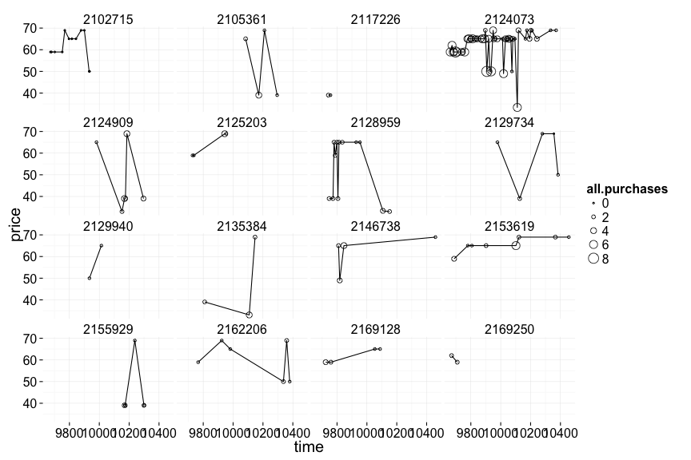

# Lesson 5
========================================================

# Multivariate Data

***

## Moira Perceived Audience Size Colored by Age
Notes:
A scatterplot with more than two variables 
(the addition of another layer, i.e, age coloring)
is difficult to interpret due to overplotting.

***

## Third Qualitative Variable

<pre class="knitr r">library(ggplot2)
library(dplyr)
library(reshape2)
</pre>

<pre class="knitr r">work_dir <- '/Users/RickyLim/Documents/OnlineLearning/DataAnalysisR/' 
pf <- read.csv(paste0(work_dir,'Data/pseudo_facebook.tsv'), sep='\t')
head(pf)
</pre>

<pre class="knitr r">##    userid age dob_day dob_year dob_month gender tenure friend_count
## 1 2094382  14      19     1999        11   male    266            0
## 2 1192601  14       2     1999        11 female      6            0
## 3 2083884  14      16     1999        11   male     13            0
## 4 1203168  14      25     1999        12 female     93            0
## 5 1733186  14       4     1999        12   male     82            0
## 6 1524765  14       1     1999        12   male     15            0
##   friendships_initiated likes likes_received mobile_likes
## 1                     0     0              0            0
## 2                     0     0              0            0
## 3                     0     0              0            0
## 4                     0     0              0            0
## 5                     0     0              0            0
## 6                     0     0              0            0
##   mobile_likes_received www_likes www_likes_received
## 1                     0         0                  0
## 2                     0         0                  0
## 3                     0         0                  0
## 4                     0         0                  0
## 5                     0         0                  0
## 6                     0         0                  0
</pre>

<pre class="knitr r">names(pf)
</pre>

<pre class="knitr r">##  [1] "userid"                "age"                  
##  [3] "dob_day"               "dob_year"             
##  [5] "dob_month"             "gender"               
##  [7] "tenure"                "friend_count"         
##  [9] "friendships_initiated" "likes"                
## [11] "likes_received"        "mobile_likes"         
## [13] "mobile_likes_received" "www_likes"            
## [15] "www_likes_received"
</pre>

<pre class="knitr r">ggplot(aes(x = gender, y = age),
       data = subset(pf, !is.na(gender))) +
    geom_boxplot() +
    stat_summary(fun.y = mean, geom='point', shape=4)
</pre>

<pre class="knitr r">ggplot(aes(x = age, y = friend_count),
       data = subset(pf, !is.na(gender)))+
    geom_line(aes(color=gender), stat='summary', fun.y = median)
</pre>

***

## Plotting Conditional Summaries
Notes:

<pre class="knitr r">pf.fc_by_age_gender <- pf %>% 
    filter(!is.na(gender)) %>%
    group_by(age, gender) %>%
    summarise(mean_friend_count = mean(friend_count),
              median_friend_count = median(friend_count),
              n = n()) %>%
    ungroup() %>%
    arrange(age)

head(pf.fc_by_age_gender)
</pre>

<pre class="knitr r">## Source: local data frame [6 x 5]
## 
##   age gender mean_friend_count median_friend_count    n
## 1  13 female          259.1606                 148  193
## 2  13   male          102.1340                  55  291
## 3  14 female          362.4286                 224  847
## 4  14   male          164.1456                  92 1078
## 5  15 female          538.6813                 276 1139
## 6  15   male          200.6658                 106 1478
</pre>

<pre class="knitr r">p <- ggplot(aes(x=age, y=median_friend_count), data=pf.fc_by_age_gender) +
        geom_line(aes(color=gender))
p
</pre>

## Reshaping Data
Notes:

Use the reshape2 library, there are two broad formats, mainly the wide and long formats.
More details info can be found [http://www.cookbook-r.com/Manipulating_data/Converting_data_between_wide_and_long_format/](here)

<pre class="knitr r"># wide format
pf.fc_by_age_gender.wide <- dcast(pf.fc_by_age_gender,
                                  age ~ gender,
                                  value.var = 'median_friend_count')
head(pf.fc_by_age_gender.wide)
</pre>

<pre class="knitr r">##   age female male
## 1  13    148   55
## 2  14    224   92
## 3  15    276  106
## 4  16    258  136
## 5  17    245  125
## 6  18    243  122
</pre>

***

## Ratio Plot
Notes:

<pre class="knitr r">p <- ggplot(aes(x=age, y=female/male), data=pf.fc_by_age_gender.wide)+
        geom_line()+
        geom_hline(yintercept=1, linetype=2, alpha=0.5)
p
</pre>

***

## Third Quantitative Variable (year joined facebook)

<pre class="knitr r">head(pf)
</pre>

<pre class="knitr r">##    userid age dob_day dob_year dob_month gender tenure friend_count
## 1 2094382  14      19     1999        11   male    266            0
## 2 1192601  14       2     1999        11 female      6            0
## 3 2083884  14      16     1999        11   male     13            0
## 4 1203168  14      25     1999        12 female     93            0
## 5 1733186  14       4     1999        12   male     82            0
## 6 1524765  14       1     1999        12   male     15            0
##   friendships_initiated likes likes_received mobile_likes
## 1                     0     0              0            0
## 2                     0     0              0            0
## 3                     0     0              0            0
## 4                     0     0              0            0
## 5                     0     0              0            0
## 6                     0     0              0            0
##   mobile_likes_received www_likes www_likes_received
## 1                     0         0                  0
## 2                     0         0                  0
## 3                     0         0                  0
## 4                     0         0                  0
## 5                     0         0                  0
## 6                     0         0                  0
</pre>

<pre class="knitr r">pf$year_joined <- with(pf, floor(2014-tenure/365))
</pre>

***

## Cut a Variable
Notes:
- Create the cut variable of year joined facebook.

<pre class="knitr r">#        (2004, 2009]
#        (2009, 2011]
#        (2011, 2012]
#        (2012, 2014]
summary(pf$year_joined)
</pre>

<pre class="knitr r">##    Min. 1st Qu.  Median    Mean 3rd Qu.    Max.    NA's 
##    2005    2012    2012    2012    2013    2014       2
</pre>

<pre class="knitr r">pf$year_joined.bucket <- with(pf, cut(pf$year_joined, breaks=c(2004,2009, 2011, 2012, 2014))) 
head(pf)
</pre>

<pre class="knitr r">##    userid age dob_day dob_year dob_month gender tenure friend_count
## 1 2094382  14      19     1999        11   male    266            0
## 2 1192601  14       2     1999        11 female      6            0
## 3 2083884  14      16     1999        11   male     13            0
## 4 1203168  14      25     1999        12 female     93            0
## 5 1733186  14       4     1999        12   male     82            0
## 6 1524765  14       1     1999        12   male     15            0
##   friendships_initiated likes likes_received mobile_likes
## 1                     0     0              0            0
## 2                     0     0              0            0
## 3                     0     0              0            0
## 4                     0     0              0            0
## 5                     0     0              0            0
## 6                     0     0              0            0
##   mobile_likes_received www_likes www_likes_received year_joined
## 1                     0         0                  0        2013
## 2                     0         0                  0        2013
## 3                     0         0                  0        2013
## 4                     0         0                  0        2013
## 5                     0         0                  0        2013
## 6                     0         0                  0        2013
##   year_joined.bucket
## 1        (2012,2014]
## 2        (2012,2014]
## 3        (2012,2014]
## 4        (2012,2014]
## 5        (2012,2014]
## 6        (2012,2014]
</pre>

***

## Plotting it All Together
Notes:

<pre class="knitr r">table(pf$year_joined.bucket, useNA='ifany')
</pre>

<pre class="knitr r">## 
## (2004,2009] (2009,2011] (2011,2012] (2012,2014]        <NA> 
##        6669       15308       33366       43658           2
</pre>

<pre class="knitr r">p <- ggplot(aes(x=age, y=friend_count), data=subset(pf, !is.na(year_joined.bucket)))+
        geom_line(aes(color=year_joined.bucket), stat='summary', fun.y=median)
p
</pre>

***

## Plot the Grand Mean
Notes:
The group with longer tenure (being in facebook longer than the others, from 2004-2009) has on average higher friend count across ages compared with others. 
This suggests that the longer time people spent on FB, they accumulate more friends across different ages.

<pre class="knitr r">p <- ggplot(aes(x=age, y=friend_count), data=subset(pf, !is.na(year_joined.bucket)))+
        geom_line(aes(color=year_joined.bucket), stat='summary', fun.y=mean) +
        geom_line(aes(color='Grand Mean'),stat='summary', fun.y=mean, linetype=2)
p
</pre>

***

## Friending Rate

<pre class="knitr r">head(pf)
</pre>

<pre class="knitr r">##    userid age dob_day dob_year dob_month gender tenure friend_count
## 1 2094382  14      19     1999        11   male    266            0
## 2 1192601  14       2     1999        11 female      6            0
## 3 2083884  14      16     1999        11   male     13            0
## 4 1203168  14      25     1999        12 female     93            0
## 5 1733186  14       4     1999        12   male     82            0
## 6 1524765  14       1     1999        12   male     15            0
##   friendships_initiated likes likes_received mobile_likes
## 1                     0     0              0            0
## 2                     0     0              0            0
## 3                     0     0              0            0
## 4                     0     0              0            0
## 5                     0     0              0            0
## 6                     0     0              0            0
##   mobile_likes_received www_likes www_likes_received year_joined
## 1                     0         0                  0        2013
## 2                     0         0                  0        2013
## 3                     0         0                  0        2013
## 4                     0         0                  0        2013
## 5                     0         0                  0        2013
## 6                     0         0                  0        2013
##   year_joined.bucket
## 1        (2012,2014]
## 2        (2012,2014]
## 3        (2012,2014]
## 4        (2012,2014]
## 5        (2012,2014]
## 6        (2012,2014]
</pre>

<pre class="knitr r">friend_rate <- with(subset(pf, tenure>=1), friend_count/tenure )
head(friend_rate)
</pre>

<pre class="knitr r">## [1] 0 0 0 0 0 0
</pre>

<pre class="knitr r">summary(friend_rate)
</pre>

<pre class="knitr r">##     Min.  1st Qu.   Median     Mean  3rd Qu.     Max. 
##   0.0000   0.0775   0.2205   0.6096   0.5658 417.0000
</pre>

<pre class="knitr r">with(subset(pf, tenure >= 1), summary(friend_count/tenure))
</pre>

<pre class="knitr r">##     Min.  1st Qu.   Median     Mean  3rd Qu.     Max. 
##   0.0000   0.0775   0.2205   0.6096   0.5658 417.0000
</pre>

***

## Friendships Initiated
Notes:

What is the median friend rate? <code class="knitr inline">0.2204861</code>

What is the maximum friend rate? <code class="knitr inline">417</code>

<pre class="knitr r">p <- ggplot(aes(x=tenure, y=friendships_initiated/tenure), data=subset(pf, tenure >=1))+
        geom_line(aes(color=year_joined.bucket), stat='summary', fun.y=mean)
p
</pre>

Notes:

The most recent tenure typically initiates less friendships.

***

### Bias-Variance Tradeoff Revisited
Notes:
Increasing the bin size will allow more estimates for the mean, therefore the noise (variance) is reduced (high bias but very much less variance).

NOTE: The code changing the binning is substituting x = tenure in the plotting expressions with x = 7 * round(tenure / 7), etc., binning values by the denominator in the round function and then transforming back to the natural scale with the constant in front.

More can be found [http://scott.fortmann-roe.com/docs/BiasVariance.html](here).

<pre class="knitr r">ggplot(aes(x = tenure, y = friendships_initiated / tenure),
       data = subset(pf, tenure >= 1)) +
  geom_line(aes(color = year_joined.bucket),
            stat = 'summary',
            fun.y = mean)
</pre>

<pre class="knitr r">ggplot(aes(x = 7 * round(tenure / 7), y = friendships_initiated / tenure),
       data = subset(pf, tenure > 0)) +
  geom_line(aes(color = year_joined.bucket),
            stat = "summary",
            fun.y = mean)
</pre>

<pre class="knitr r">ggplot(aes(x = 30 * round(tenure / 30), y = friendships_initiated / tenure),
       data = subset(pf, tenure > 0)) +
  geom_line(aes(color = year_joined.bucket),
            stat = "summary",
            fun.y = mean)
</pre>

<pre class="knitr r">ggplot(aes(x = 90 * round(tenure / 90), y = friendships_initiated / tenure),
       data = subset(pf, tenure > 0)) +
  geom_line(aes(color = year_joined.bucket),
            stat = "summary",
            fun.y = mean)
</pre>

<pre class="knitr r">p <- ggplot(aes(x = tenure, y = friendships_initiated / tenure),
            data = subset(pf, tenure > 0)) +
        geom_smooth(aes(color = year_joined.bucket))
p
</pre>

***

### Sean's NFL Fan Sentiment Study
Notes:

***

### Introducing the Yogurt Data Set
Notes:

***

### Histograms Revisited
Notes:
The prices are discrete variables shown by the histogram. 
When, the bindwith is increased the histogram shows the absence of adjacent spaces among discrete variables, therefore the histogram with binwidth of 10 shows a bias distribution of prices.

<pre class="knitr r">yo <- read.csv(paste0(work_dir, 'Data/yogurt.csv'))
head(yo)
</pre>

<pre class="knitr r">##   obs      id  time strawberry blueberry pina.colada plain mixed.berry
## 1   1 2100081  9678          0         0           0     0           1
## 2   2 2100081  9697          0         0           0     0           1
## 3   3 2100081  9825          0         0           0     0           1
## 4   4 2100081  9999          0         0           0     0           1
## 5   5 2100081 10015          1         0           1     0           1
## 6   6 2100081 10029          1         0           2     0           1
##   price
## 1 58.96
## 2 58.96
## 3 65.04
## 4 65.04
## 5 48.96
## 6 65.04
</pre>

<pre class="knitr r">str(yo)
</pre>

<pre class="knitr r">## 'data.frame':	2380 obs. of  9 variables:
##  $ obs        : int  1 2 3 4 5 6 7 8 9 10 ...
##  $ id         : int  2100081 2100081 2100081 2100081 2100081 2100081 2100081 2100081 2100081 2100081 ...
##  $ time       : int  9678 9697 9825 9999 10015 10029 10036 10042 10083 10091 ...
##  $ strawberry : int  0 0 0 0 1 1 0 0 0 0 ...
##  $ blueberry  : int  0 0 0 0 0 0 0 0 0 0 ...
##  $ pina.colada: int  0 0 0 0 1 2 0 0 0 0 ...
##  $ plain      : int  0 0 0 0 0 0 0 0 0 0 ...
##  $ mixed.berry: int  1 1 1 1 1 1 1 1 1 1 ...
##  $ price      : num  59 59 65 65 49 ...
</pre>

<pre class="knitr r">yo$id <- factor(yo$id)
str(yo)
</pre>

<pre class="knitr r">## 'data.frame':	2380 obs. of  9 variables:
##  $ obs        : int  1 2 3 4 5 6 7 8 9 10 ...
##  $ id         : Factor w/ 332 levels "2100081","2100370",..: 1 1 1 1 1 1 1 1 1 1 ...
##  $ time       : int  9678 9697 9825 9999 10015 10029 10036 10042 10083 10091 ...
##  $ strawberry : int  0 0 0 0 1 1 0 0 0 0 ...
##  $ blueberry  : int  0 0 0 0 0 0 0 0 0 0 ...
##  $ pina.colada: int  0 0 0 0 1 2 0 0 0 0 ...
##  $ plain      : int  0 0 0 0 0 0 0 0 0 0 ...
##  $ mixed.berry: int  1 1 1 1 1 1 1 1 1 1 ...
##  $ price      : num  59 59 65 65 49 ...
</pre>

<pre class="knitr r">summary(yo$price)
</pre>

<pre class="knitr r">##    Min. 1st Qu.  Median    Mean 3rd Qu.    Max. 
##   20.00   50.00   65.04   59.25   68.96   68.96
</pre>

<pre class="knitr r">p <- ggplot(aes(x=price), data=yo) +
        geom_histogram()
p
</pre>

<pre class="knitr r">p_10 <- ggplot(aes(x=price), data=yo) +
        geom_histogram(binwidth=10)
p_10
</pre>

***

### Number of Purchases
Notes:

<pre class="knitr r">summary(yo)
</pre>

<pre class="knitr r">##       obs               id            time         strawberry     
##  Min.   :   1.0   2132290:  74   Min.   : 9662   Min.   : 0.0000  
##  1st Qu.: 696.5   2130583:  59   1st Qu.: 9843   1st Qu.: 0.0000  
##  Median :1369.5   2124073:  50   Median :10045   Median : 0.0000  
##  Mean   :1367.8   2149500:  50   Mean   :10050   Mean   : 0.6492  
##  3rd Qu.:2044.2   2101790:  47   3rd Qu.:10255   3rd Qu.: 1.0000  
##  Max.   :2743.0   2129528:  39   Max.   :10459   Max.   :11.0000  
##                   (Other):2061                                    
##    blueberry        pina.colada          plain         mixed.berry    
##  Min.   : 0.0000   Min.   : 0.0000   Min.   :0.0000   Min.   :0.0000  
##  1st Qu.: 0.0000   1st Qu.: 0.0000   1st Qu.:0.0000   1st Qu.:0.0000  
##  Median : 0.0000   Median : 0.0000   Median :0.0000   Median :0.0000  
##  Mean   : 0.3571   Mean   : 0.3584   Mean   :0.2176   Mean   :0.3887  
##  3rd Qu.: 0.0000   3rd Qu.: 0.0000   3rd Qu.:0.0000   3rd Qu.:0.0000  
##  Max.   :12.0000   Max.   :10.0000   Max.   :6.0000   Max.   :8.0000  
##                                                                       
##      price      
##  Min.   :20.00  
##  1st Qu.:50.00  
##  Median :65.04  
##  Mean   :59.25  
##  3rd Qu.:68.96  
##  Max.   :68.96  
## 
</pre>

<pre class="knitr r">length(unique(yo$price))
</pre>

<pre class="knitr r">## [1] 20
</pre>

<pre class="knitr r">table(yo$price)
</pre>

<pre class="knitr r">## 
##    20 24.96 33.04  33.2 33.28 33.36 33.52 39.04    44 45.04 48.96 49.52 
##     2    11    54     1     1    22     1   234    21    11    81     1 
##  49.6    50 55.04 58.96    62 63.04 65.04 68.96 
##     1   205     6   303    15     2   799   609
</pre>

<pre class="knitr r">yo <- transform(yo, all.purchases = strawberry + blueberry + pina.colada + mixed.berry)
head(yo)
</pre>

<pre class="knitr r">##   obs      id  time strawberry blueberry pina.colada plain mixed.berry
## 1   1 2100081  9678          0         0           0     0           1
## 2   2 2100081  9697          0         0           0     0           1
## 3   3 2100081  9825          0         0           0     0           1
## 4   4 2100081  9999          0         0           0     0           1
## 5   5 2100081 10015          1         0           1     0           1
## 6   6 2100081 10029          1         0           2     0           1
##   price all.purchases
## 1 58.96             1
## 2 58.96             1
## 3 65.04             1
## 4 65.04             1
## 5 48.96             3
## 6 65.04             4
</pre>

<pre class="knitr r">p <- ggplot(aes(x=all.purchases),data = yo) +
        geom_histogram(binwidth=1, breaks=seq(0,15,1))
p
</pre>

***

### Prices over Time
Notes:

<pre class="knitr r">p <- ggplot(aes(x=time, y=price), data=yo) +
        geom_jitter(alpha=1/10, shape=21, fill=I('#F79420'))
p
</pre>

***

### Sampling Observations
Notes:

***

### Looking at Samples of Households

Notes:

x %in% y returns a logical (boolean) vector the same length as x that says whether each entry in x appears in y. That is, for each entry in x, it checks to see whether it is in y.

<pre class="knitr r">set.seed(123)
sample.ids <- sample(levels(yo$id), 16)

p <- ggplot(aes(x=time, y=price), 
            data=subset(yo, id %in% sample.ids)) +
        facet_wrap(~id) +
        geom_line()+
        geom_point(aes(size=all.purchases), pch=1)

p
</pre>

***

### The Limits of Cross Sectional Data
Notes:

    - It's a snapshot at a particular time period so no indication of the sequence of events, no causal inference
    - Only a snapshot, the situation may provide differing results if another time-frame had been chosen  
    - Prevalence-incidence bias (neyman bias)

### Scatterplot Matrix
Notes:
- When the data are categorical use boxplot or histogram, otherwise scatterplot is very helpful .

<pre class="knitr r">library(GGally)
theme_set(theme_minimal(20))

set.seed(12345)
head(pf)
</pre>

<pre class="knitr r">##    userid age dob_day dob_year dob_month gender tenure friend_count
## 1 2094382  14      19     1999        11   male    266            0
## 2 1192601  14       2     1999        11 female      6            0
## 3 2083884  14      16     1999        11   male     13            0
## 4 1203168  14      25     1999        12 female     93            0
## 5 1733186  14       4     1999        12   male     82            0
## 6 1524765  14       1     1999        12   male     15            0
##   friendships_initiated likes likes_received mobile_likes
## 1                     0     0              0            0
## 2                     0     0              0            0
## 3                     0     0              0            0
## 4                     0     0              0            0
## 5                     0     0              0            0
## 6                     0     0              0            0
##   mobile_likes_received www_likes www_likes_received year_joined
## 1                     0         0                  0        2013
## 2                     0         0                  0        2013
## 3                     0         0                  0        2013
## 4                     0         0                  0        2013
## 5                     0         0                  0        2013
## 6                     0         0                  0        2013
##   year_joined.bucket
## 1        (2012,2014]
## 2        (2012,2014]
## 3        (2012,2014]
## 4        (2012,2014]
## 5        (2012,2014]
## 6        (2012,2014]
</pre>

<pre class="knitr r">pf_subset <- pf[, c(2:15)]
names(pf_subset)
</pre>

<pre class="knitr r">##  [1] "age"                   "dob_day"              
##  [3] "dob_year"              "dob_month"            
##  [5] "gender"                "tenure"               
##  [7] "friend_count"          "friendships_initiated"
##  [9] "likes"                 "likes_received"       
## [11] "mobile_likes"          "mobile_likes_received"
## [13] "www_likes"             "www_likes_received"
</pre>

<pre class="knitr r">ggpairs(pf_subset[sample.int(nrow(pf_subset), 1000), ])
</pre>

***

### Even More Variables
Notes:

***

### Heat Maps
Notes:

<pre class="knitr r">nci <- read.table(paste0(work_dir, "Data/nci.tsv"))
colnames(nci) <- c(1:64)
</pre>

<pre class="knitr r">library(reshape2)
nci.long.samp <- melt(as.matrix(nci[1:200,]))
names(nci.long.samp) <- c("gene", "case", "value")
head(nci.long.samp)
</pre>

<pre class="knitr r">##   gene case  value
## 1    1    1  0.300
## 2    2    1  1.180
## 3    3    1  0.550
## 4    4    1  1.140
## 5    5    1 -0.265
## 6    6    1 -0.070
</pre>

<pre class="knitr r">ggplot(aes(y = gene, x = case, fill = value),
        data = nci.long.samp) +
        geom_tile() +
        scale_fill_gradientn(colours = colorRampPalette(c("blue", "red"))(100))
</pre>

<pre class="knitr r">p
</pre>

***

# Problem set

## Diamonds

<pre class="knitr r">head(diamonds)
</pre>

<pre class="knitr r">##   carat       cut color clarity depth table price    x    y    z
## 1  0.23     Ideal     E     SI2  61.5    55   326 3.95 3.98 2.43
## 2  0.21   Premium     E     SI1  59.8    61   326 3.89 3.84 2.31
## 3  0.23      Good     E     VS1  56.9    65   327 4.05 4.07 2.31
## 4  0.29   Premium     I     VS2  62.4    58   334 4.20 4.23 2.63
## 5  0.31      Good     J     SI2  63.3    58   335 4.34 4.35 2.75
## 6  0.24 Very Good     J    VVS2  62.8    57   336 3.94 3.96 2.48
</pre>

<pre class="knitr r">p <- ggplot(aes(x=price), data=diamonds) +
        facet_wrap(~color) +
        geom_histogram(aes(fill=cut)) +
        scale_fill_brewer(type = 'qual')

p
</pre>

<pre class="knitr r">p <- ggplot(aes(x=table, y=price), data=diamonds)+
        geom_point(aes(color=cut)) +
        scale_color_brewer(type = 'qual')
p
</pre>

<pre class="knitr r">tapply(diamonds$table, diamonds$cut, summary)
</pre>

<pre class="knitr r">## $Fair
##    Min. 1st Qu.  Median    Mean 3rd Qu.    Max. 
##   49.00   56.00   58.00   59.05   61.00   95.00 
## 
## $Good
##    Min. 1st Qu.  Median    Mean 3rd Qu.    Max. 
##   51.00   56.00   58.00   58.69   61.00   66.00 
## 
## $`Very Good`
##    Min. 1st Qu.  Median    Mean 3rd Qu.    Max. 
##   44.00   56.00   58.00   57.96   59.00   66.00 
## 
## $Premium
##    Min. 1st Qu.  Median    Mean 3rd Qu.    Max. 
##   51.00   58.00   59.00   58.75   60.00   62.00 
## 
## $Ideal
##    Min. 1st Qu.  Median    Mean 3rd Qu.    Max. 
##   43.00   55.00   56.00   55.95   57.00   63.00
</pre>

<pre class="knitr r">diamonds$volume <- with(diamonds, x*y*z)
p <- ggplot(aes(x=volume, y=price), 
            data=subset(diamonds, volume >0)) +
        geom_point(aes(color=clarity)) +
        xlim(0, quantile(diamonds$volume, 0.99))+
        scale_y_log10()+
        scale_color_brewer(type='div')
p
</pre>

## Facebook

<pre class="knitr r"># proportions of friends initiated
head(pf)
</pre>

<pre class="knitr r">##    userid age dob_day dob_year dob_month gender tenure friend_count
## 1 2094382  14      19     1999        11   male    266            0
## 2 1192601  14       2     1999        11 female      6            0
## 3 2083884  14      16     1999        11   male     13            0
## 4 1203168  14      25     1999        12 female     93            0
## 5 1733186  14       4     1999        12   male     82            0
## 6 1524765  14       1     1999        12   male     15            0
##   friendships_initiated likes likes_received mobile_likes
## 1                     0     0              0            0
## 2                     0     0              0            0
## 3                     0     0              0            0
## 4                     0     0              0            0
## 5                     0     0              0            0
## 6                     0     0              0            0
##   mobile_likes_received www_likes www_likes_received year_joined
## 1                     0         0                  0        2013
## 2                     0         0                  0        2013
## 3                     0         0                  0        2013
## 4                     0         0                  0        2013
## 5                     0         0                  0        2013
## 6                     0         0                  0        2013
##   year_joined.bucket
## 1        (2012,2014]
## 2        (2012,2014]
## 3        (2012,2014]
## 4        (2012,2014]
## 5        (2012,2014]
## 6        (2012,2014]
</pre>

<pre class="knitr r">prop_initiated <- NA
pf$prop_initiated <- with(pf, ifelse(friend_count != 0, 
                          friendships_initiated/friend_count,0))

p <- ggplot(aes(x=tenure, y=prop_initiated),
            data=subset(pf, !is.na(year_joined.bucket)))+
        geom_line(aes(color=year_joined.bucket))

x <- subset(pf, !is.na(year_joined.bucket) & prop_initiated > 0)
head(x)
</pre>

<pre class="knitr r">##       userid age dob_day dob_year dob_month gender tenure friend_count
## 1963 1295206  14      15     1999        12 female    126            1
## 1964 1549189  14      20     1999        12 female     95            1
## 1965 1102182  14      10     1999        12 female      2            1
## 1966 1433884  13      15     2000         1   male    199            1
## 1969 1430781  13       1     2000         1   male    232            1
## 1970 1237099  13       1     2000         1   male     52            1
##      friendships_initiated likes likes_received mobile_likes
## 1963                     1     0              0            0
## 1964                     1     0              0            0
## 1965                     1     0              0            0
## 1966                     1     0              0            0
## 1969                     1     0              0            0
## 1970                     1     0              0            0
##      mobile_likes_received www_likes www_likes_received year_joined
## 1963                     0         0                  0        2013
## 1964                     0         0                  0        2013
## 1965                     0         0                  0        2013
## 1966                     0         0                  0        2013
## 1969                     0         0                  0        2013
## 1970                     0         0                  0        2013
##      year_joined.bucket prop_initiated
## 1963        (2012,2014]              1
## 1964        (2012,2014]              1
## 1965        (2012,2014]              1
## 1966        (2012,2014]              1
## 1969        (2012,2014]              1
## 1970        (2012,2014]              1
</pre>

## Metainfo

Filename: lesson5_student.rmd

Working directory: <code class="knitr inline">/Users/RickyLim/Documents/OnlineLearning/DataAnalysisR/EDA_Course_Materials/lesson5</code>

<pre class="knitr r">sessionInfo()
</pre>

<pre class="knitr r">## R version 3.1.1 (2014-07-10)
## Platform: x86_64-apple-darwin13.3.0 (64-bit)
## 
## locale:
## [1] en_US.UTF-8/en_US.UTF-8/en_US.UTF-8/C/en_US.UTF-8/en_US.UTF-8
## 
## attached base packages:
## [1] stats     graphics  grDevices utils     datasets  methods   base     
## 
## other attached packages:
## [1] GGally_0.5.0         mgcv_1.8-0           nlme_3.1-117        
## [4] reshape2_1.4         dplyr_0.3.0.2        ggplot2_1.0.0       
## [7] knitrBootstrap_0.9.0 knitr_1.8           
## 
## loaded via a namespace (and not attached):
##  [1] assertthat_0.1     codetools_0.2-8    colorspace_1.2-4  
##  [4] DBI_0.3.1          digest_0.6.4       evaluate_0.5.5    
##  [7] formatR_1.0        grid_3.1.1         gtable_0.1.2      
## [10] labeling_0.3       lattice_0.20-29    lazyeval_0.1.9    
## [13] magrittr_1.5       markdown_0.7.4     MASS_7.3-33       
## [16] Matrix_1.1-4       munsell_0.4.2      parallel_3.1.1    
## [19] plyr_1.8.1         proto_0.3-10       RColorBrewer_1.0-5
## [22] Rcpp_0.11.3        reshape_0.8.5      scales_0.2.4      
## [25] stringr_0.6.2      tools_3.1.1
</pre>

<pre class="knitr r">library(knitr)
library(knitrBootstrap)
knit_bootstrap("lesson5_student.rmd")
</pre>

<pre class="knitr r">## Error in parse_block(g[-1], g[1], params.src): duplicate label 'global_setup'
</pre>

